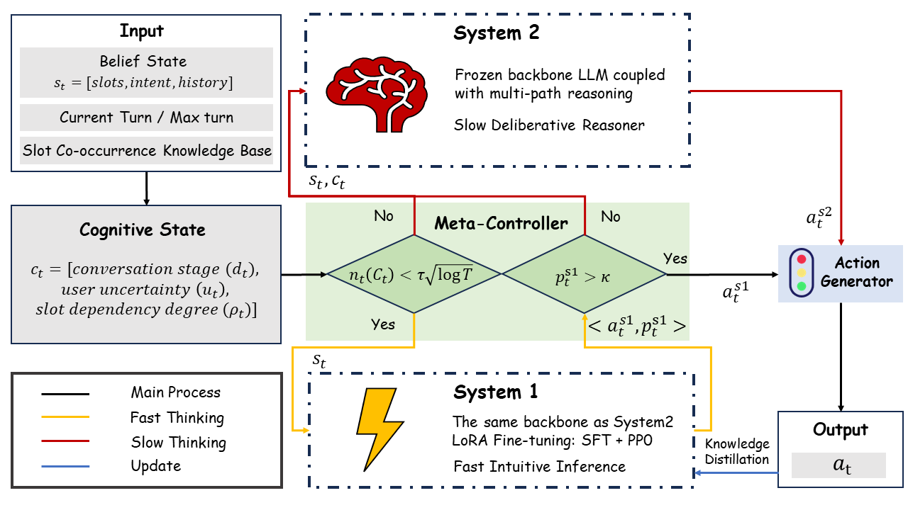

# 🧠 DyBBT: Dynamic Balance via Bandit inspired Targeting for Dialog Policy with Cognitive Dual-Systems

Official PyTorch implementation for **"DyBBT: Dynamic Balance via Bandit inspired Targeting for Dialog Policy with Cognitive Dual-Systems"**. This repository contains the complete end-to-end code to reproduce our results, including the online generation of all results described in our work.



## 📋 Table of Contents
- [✨ Features](#-features)
- [⚙️ Installation & Setup](#️-installation--setup)
- [🚀 End-to-End Workflow](#-end-to-end-workflow)
- [📂 Project Structure](#-project-structure)
- [📊 Datasets](#-datasets)
- [📚 Model Training](#-model-training)
- [📈 Evaluation](#-evaluation)
- [🤝 Contributing](#-contributing)
- [📜 License](#-license)

## ✨ Features

### 🎯 Cognitive State Space
- **Formalized cognitive state space** $\mathcal{C} = [d_t, u_t, \rho_t]$ capturing dialog progression, user uncertainty, and slot dependency
- **Interpretable representation** of dialog affordances based on Gibson's ecological psychology
- **Real-time cognitive state tracking** for adaptive exploration

### ⚡ Dual-System Architecture
- **System 1 (S1)**: Fast intuitive inference using LoRA-finetuned Qwen3-1.7B model
- **System 2 (S2)**: Slow deliberative reasoning with Top-3 action sequence generation
- **Bandit-inspired meta-controller** for dynamic system switching

### 🔄 Dynamic Balance Principle
- **Adaptive exploration** based on cognitive state visitation counts
- **Cost-aware deliberation** that invokes System 2 only when necessary
- **Sublinear regret guarantee** with Lipschitz smooth reward assumption

## ⚙️ Installation & Setup

**Python Version Requirement:** Python 3.10 or higher is required for this project.

```shell
# Create virtual environment
python -m venv dybbt_env
source dybbt_env/bin/activate

# Install dependencies
pip install -r requirements.txt

# Install ConvLab framework (if not already installed)
pip install -e .

# Verify installation
python -c "import torch; print(f'PyTorch version: {torch.__version__}')"
python -c "from DyBBT import DyBBT; print('DyBBT imported successfully')"
```

## 🚀 End-to-End Workflow

### 📦 Dataset Preparation
```shell
# Process MultiWOZ 2.1
python -m convlab.util.multiwoz.create_multiwoz21

# Build slot co-occurrence matrix
python -m DyBBT.slot_comatrix.build_slot_cooccurrence_matrix
```

### 🚀 Training DyBBT
```shell
# Single-domain training (Restaurant domain)
python -m DyBBT.train --path ./DyBBT/configs/dybbt.json --dataset msdialog --domain taxi

# Multi-domain training
python -m DyBBT.train --path ./DyBBT/configs/dybbt.json --dataset multiwoz21 --all-domains

# Custom configuration
python -m DyBBT.train --path ./DyBBT/configs/dybbt.json \
    --tau 0.5 \
    --confidence_threshold 0.7 \
    --uncertainty_threshold 0.3 \
    --max_turns 350
```

### 📊 Evaluation
```shell
# Evaluate trained DyBBT policy
python -m DyBBT.train --path ./DyBBT/configs/dybbt.json --test --ckpt_best save/ckpt_best.pt

# Human evaluation interface
python -m convlab.human_eval.run --policy DyBBT --config ./DyBBT/configs/dybbt.json
```

## 📂 Project Structure

```
DyBBT/
├── DyBBT.py                 # Core DyBBT implementation
├── configs/
│   └── dybbt.json          # Main configuration file
├── cognitive_state/
│   └── calc_visit_cnt.py   # Cognitive state visitation counting
├── slot_comatrix/
│   ├── build_slot_cooccurrence_matrix.py  # Slot dependency analysis
│   └── slot_cooccurrence_matrix.pkl       # Precomputed co-occurrence matrix
├── finetune/
│   ├── sft/                # Supervised fine-tuning scripts
│   └── ppo/                # PPO optimization scripts
├── train.py               # Main training script
└── utils.py               # Utility functions

convlab/                   # Modified ConvLab framework
├── util/
│   ├── custom_util.py                 # customed utils for MultiWOZ
│   └── custom_util_msdialog.py/       # customed utils for MSDialog
└── dialog_agent/
    └── env.py            # dialog environment

data/unified_datasets     # Dataset directories
├── multiwoz21/
├── msdialog_movie/
├── msdialog_restaurant/
└── msdialog_taxi/
```

## 📊 Datasets

DyBBT supports both MultiWOZ 2.1 and MSDialog datasets:

### MultiWOZ 2.1
- Multi-domain dialog dataset with 7 domains
- Standard benchmark for task-oriented dialog systems

### MSDialog
Three single-domain datasets converted from EIERL format:
- **MSDialog Movie**: Movie ticket booking domain
- **MSDialog Restaurant**: Restaurant reservation domain  
- **MSDialog Taxi**: Taxi ordering domain

All datasets are preprocessed into ConvLab-3 unified format for consistency.

## 📚 Model Training

### System 1 (Fast Intuitive Inference)
System 1 is implemented as a LoRA-finetuned Qwen3 model:
```bash
# Train System 1 with Supervised Fine-Tuning
python -m DyBBT.finetune.sft.sft_train_msdialog --domain movie --epochs 10
```

### System 2 (Slow Deliberative Reasoning)
System 2 uses the base Qwen3 model for complex reasoning tasks.

### Meta-Controller Training
The meta-controller uses bandit-inspired heuristics with two conditions:
1. Exploration condition: $n_t(\mathbf{c}_t) < \tau \sqrt{\log T}$
2. Confidence condition: $p_t^{S1} < \kappa$

## 📈 Evaluation

DyBBT can be evaluated on both automatic metrics and human evaluation:

### Automatic Evaluation Metrics
- **Success Rate**: Percentage of successfully completed tasks
- **Average Turns**: Average number of dialog turns to complete tasks
- **Reward**: Task-specific reward function

### Human Evaluation
Human evaluation focuses on:
- Action appropriateness (5-point Likert scale)
- Justification of System 2 invocation decisions

## 🤝 Contributing

We welcome contributions to enhance DyBBT. If you're interested in contributing, please follow these steps:

🍴 Fork the repository

🌿 Create a new branch for your feature or bug fix 
```shell
git checkout -b feature/AmazingFeature
```

💬 Commit your changes with clear messages
```shell
git commit -m 'Add some AmazingFeature'
```

📤 Push to your forked repository
```shell
git push origin feature/AmazingFeature
```

📥 Open a Pull Request detailing your changes and motivation

## 📜 License

This project is licensed under the MIT License - see the LICENSE file for details.

---